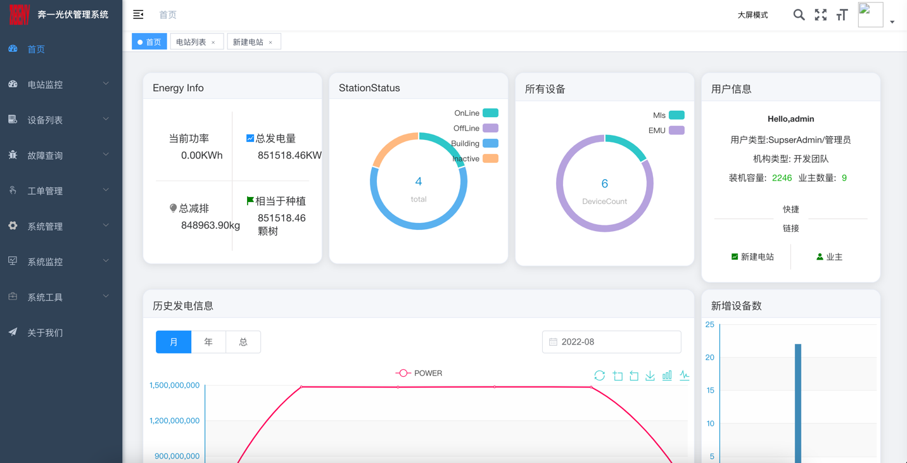
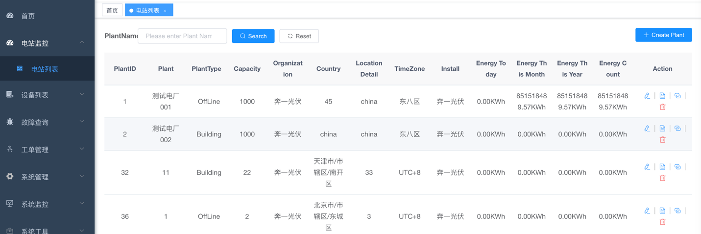
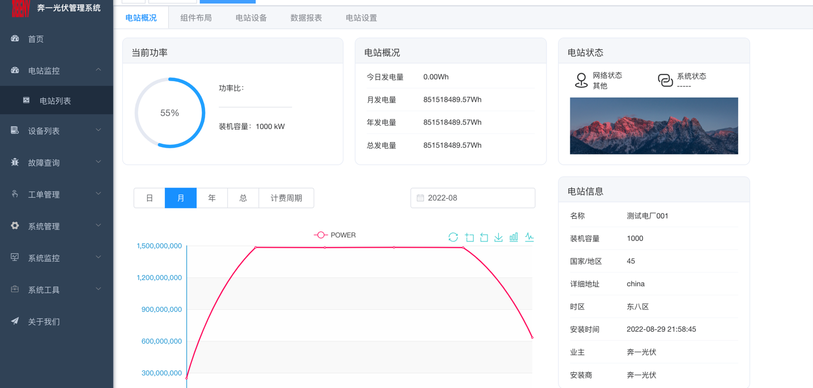
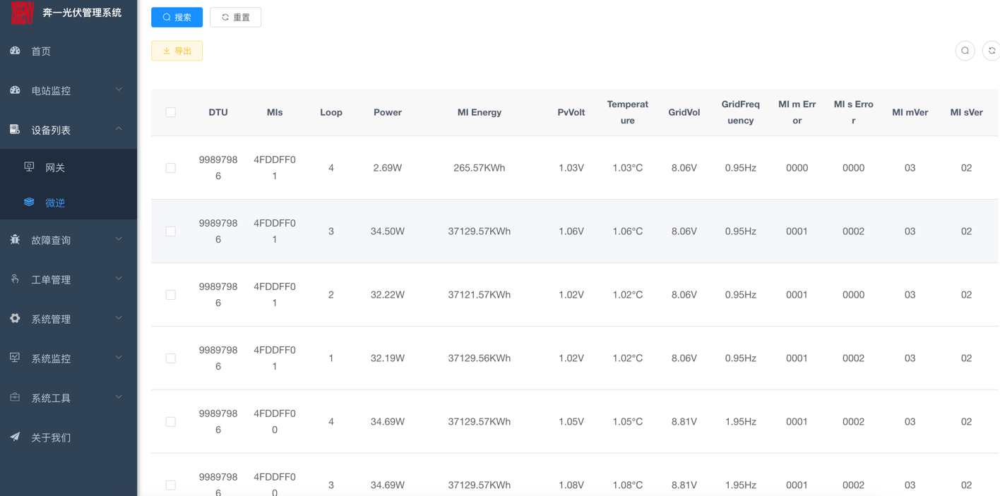

<h1 align="center" style="margin: 30px 0 30px; font-weight: bold;">Benyi v0.1.0</h1>
<h4 align="center">基于SpringBoot、Spring Security、Jwt、Vue的前后端分离的后台管理系统</h4>


## 平台简介

奔一光伏管理系统

* 前端采用Vue、Element UI。
* 后端采用Spring Boot、Spring Security、Redis & Jwt。
* 权限认证使用Jwt，支持多终端认证系统。
* 支持加载动态权限菜单，多方式轻松权限控制。

### 系统需求

* JDK >= 1.8
* MySQL >= 5.7
* Maven >= 3.0
* Node >= 12
* Redis >= 3

### 技术选型

1、系统环境

Java EE 8
Servlet 3.0
Apache Maven 3

2、主框架

Spring Boot 2.2.x
Spring Framework 5.2.x
Spring Security 5.2.x

3、持久层

Apache MyBatis 3.5.x
Hibernate Validation 6.0.x
Alibaba Druid 1.2.x

4、视图层

Vue 2.6.x
Axios 0.21.x
Element 2.15.x

## 环境部署

准备工作
```
JDK >= 1.8 (推荐1.8版本)
Mysql >= 5.7.0 (推荐5.7版本)
Redis >= 3.0
Maven >= 3.0
Node >= 12
```

### 前端运行

```

# 进入项目目录
cd benyi-ui

# 安装依赖
npm install

# 强烈建议不要用直接使用 cnpm 安装，会有各种诡异的 bug，可以通过重新指定 registry 来解决 npm 安装速度慢的问题。
npm install --registry=https://registry.npmmirror.com

# 本地开发 启动项目
npm run dev

```

### 必要配置

* 修改数据库连接，编辑resources目录下的application-druid.yml

```

# 数据源配置
spring:
    datasource:
        type: com.alibaba.druid.pool.DruidDataSource
        driverClassName: com.mysql.cj.jdbc.Driver
        druid:
            # 主库数据源
            master:
                url: 数据库地址
                username: 数据库账号
                password: 数据库密码


```

#修改服务器配置，编辑resources目录下的application.yml

```

# 开发环境配置
server:
  # 服务器的HTTP端口，默认为80
  port: 端口
  servlet:
    # 应用的访问路径
    context-path: /应用路径


```

### 部署系统

## 后端部署

* 打包工程文件
在benyi项目的bin目录下执行package.bat打包Web工程，生成war/jar包文件。
然后会在项目下生成target文件夹包含war或jar

* 部署工程文件
1、jar部署方式
使用命令行执行：java –jar benyi.jar 或者执行脚本：benyi/bin/run.bat

2、war部署方式
benyi/pom.xml中的packaging修改为war，放入tomcat服务器webapps

* SpringBoot去除内嵌Tomcat（PS：此步骤不重要，因为不排除也能在容器中部署war）


```

<!-- 多模块排除内置tomcat -->
<dependency>
	<groupId>org.springframework.boot</groupId>
	<artifactId>spring-boot-starter-web</artifactId>
	<exclusions>
		<exclusion>
			<groupId>org.springframework.boot</groupId>
			<artifactId>spring-boot-starter-tomcat</artifactId>
		</exclusion>
	</exclusions>
</dependency>
		
<!-- 单应用排除内置tomcat -->		
<exclusions>
	<exclusion>
		<artifactId>spring-boot-starter-tomcat</artifactId>
		<groupId>org.springframework.boot</groupId>
	</exclusion>
</exclusions>

```

### 前端部署

当项目开发完毕，只需要运行一行命令就可以打包你的应用

```

# 打包正式环境
npm run build:prod

# 打包预发布环境
npm run build:stage

``` 

构建打包成功之后，会在根目录生成 dist 文件夹，里面就是构建打包好的文件，通常是 ***.js 、***.css、index.html 等静态文件。

通常情况下 dist 文件夹的静态文件发布到你的 nginx 或者静态服务器即可，其中的 index.html 是后台服务的入口页面。

publicPath 提示

部署时改变页面js 和 css 静态引入路径 ,只需修改 vue.config.js 文件资源路径即可。

```

publicPath: './' //请根据自己路径来配置更改


export default new Router({
  mode: 'hash', // hash模式
})

```


## 环境变量

所有测试环境或者正式环境变量的配置都在 .env.development (opens new window)等 .env.xxxx文件中。

它们都会通过 webpack.DefinePlugin 插件注入到全局。

环境变量必须以VUE_APP_为开头。如:VUE_APP_API、VUE_APP_TITLE

你在代码中可以通过如下方式获取:

```

console.log(process.env.VUE_APP_xxxx)

```

## Tomcat配置

```
<Context docBase="" path="/" reloadable="true" source=""/>
```

dist目录的文件夹下新建WEB-INF文件夹，并在里面添加web.xml文件

```

<?xml version="1.0" encoding="UTF-8"?>
<web-app xmlns="http://xmlns.jcp.org/xml/ns/javaee" 
        xmlns:xsi="http://www.w3.org/2001/XMLSchema-instance"
        xsi:schemaLocation="http://xmlns.jcp.org/xml/ns/javaee
        http://xmlns.jcp.org/xml/ns/javaee/web-app_3_1.xsd"
        version="3.1" metadata-complete="true">
     <display-name>Router for Tomcat</display-name>
     <error-page>
        <error-code>404</error-code>
        <location>/index.html</location>
    </error-page>
</web-app>

```

### Nginx配置

```

worker_processes  1;

events {
    worker_connections  1024;
}

http {
    include       mime.types;
    default_type  application/octet-stream;
    sendfile        on;
    keepalive_timeout  65;

    server {
        listen       80;
        server_name  localhost;
		charset utf-8;

		location / {
            root   /home/ruoyi/projects/ruoyi-ui;
			try_files $uri $uri/ /index.html;
            index  index.html index.htm;
        }
		
		location /prod-api/ {
			proxy_set_header Host $http_host;
			proxy_set_header X-Real-IP $remote_addr;
			proxy_set_header REMOTE-HOST $remote_addr;
			proxy_set_header X-Forwarded-For $proxy_add_x_forwarded_for;
			proxy_pass http://localhost:8080/;
		}

        error_page   500 502 503 504  /50x.html;
        location = /50x.html {
            root   html;
        }
    }
}

```

### 文件结构

# 后端结构

com.benyi<br/>
├── common            // 工具类<br/>
│       └── annotation                    // 自定义注解<br/>
│       └── config                        // 全局配置<br/>
│       └── constant                      // 通用常量<br/>
│       └── core                          // 核心控制<br/>
│       └── enums                         // 通用枚举<br/>
│       └── exception                     // 通用异常<br/>
│       └── filter                        // 过滤器处理<br/>
│       └── utils                         // 通用类处理<br/>
├── framework         // 框架核心<br/>
│       └── aspectj                       // 注解实现<br/>
│       └── config                        // 系统配置<br/>
│       └── datasource                    // 数据权限<br/>
│       └── interceptor                   // 拦截器<br/>
│       └── manager                       // 异步处理<br/>
│       └── security                      // 权限控制<br/>
│       └── web                           // 前端控制<br/>
├── benyi-generator   // 代码生成（可移除）<br/>
├── benyi-quartz      // 定时任务（可移除）<br/>
├── benyi-energy      // 发电数据处理模块<br/>
├── benyi-system      // 系统代码<br/>
├── benyi-admin       // 后台服务<br/>

# 前端结构
├── build                      // 构建相关  <br/>
├── bin                        // 执行脚本<br/>
├── public                     // 公共文件<br/>
│   ├── favicon.ico            // favicon图标<br/>
│   └── index.html             // html模板<br/>
│   └── robots.txt             // 反爬虫<br/>
├── src                        // 源代码<br/>
│   ├── api                    // 所有请求<br/>
│   ├── assets                 // 主题 字体等静态资源<br/>
│   ├── components             // 全局公用组件<br/>
│   ├── directive              // 全局指令<br/>
│   ├── layout                 // 布局<br/>
│   ├── plugins                // 通用方法<br/>
│   ├── languages              // 国际化<br/>
│   ├── router                 // 路由<br/>
│   ├── store                  // 全局 store管理<br/>
│   ├── utils                  // 全局公用方法<br/>
│   ├── views                  // view<br/>
│   ├── App.vue                // 入口页面<br/>
│   ├── main.js                // 入口 加载组件 初始化等<br/>
│   ├── permission.js          // 权限管理<br/>
│   └── settings.js            // 系统配置<br/>
├── .editorconfig              // 编码格式<br/>
├── .env.development           // 开发环境配置<br/>
├── .env.production            // 生产环境配置<br/>
├── .env.staging               // 测试环境配置<br/>
├── .eslintignore              // 忽略语法检查<br/>
├── .eslintrc.js               // eslint 配置项<br/>
├── .gitignore                 // git 忽略项<br/>
├── babel.config.js            // babel.config.js<br/>
├── package.json               // package.json<br/>
└── vue.config.js              // vue.config.js<br/>

## 前端通用方法
*    $tab对象:用于做页签操作、刷新页签、关闭页签、打开页签、修改页签等，定义在plugins/tab.js
*    $modal对象:用于做消息提示、通知提示、对话框提醒、二次确认、遮罩等，定义在plugins/modal.js
*    $t对象:用于国际化文本处理，定义在plugins/i18n.js
*    $auth:对象用于验证用户是否拥有某（些）权限或角色，定义在plugins/auth.js
*    $cache:对象用于处理缓存。
*    $download:对象用于文件下载，定义在plugins/download.js

## 配置文件

通用配置 application.yml
数据源配置 application-druid.yml

## 核心技术
* 前端技术栈 ES6、vue、vuex、vue-router、vue-cli、axios、element-ui
* 后端技术栈 SpringBoot、MyBatis、Spring Security、Jwt

## 后端技术

1、介绍
Spring Boot是一款开箱即用框架，提供各种默认配置来简化项目配置。让我们的Spring应用变的更轻量化、更快的入门。 在主程序执行main函数就可以运行。你也可以打包你的应用为jar并通过使用java -jar来运行你的Web应用。它遵循"约定优先于配置"的原则， 使用SpringBoot只需很少的配置，大部分的时候直接使用默认的配置即可。同时可以与Spring Cloud的微服务无缝结合。

Spring Boot2.x版本环境要求必须是jdk8或以上版本，服务器Tomcat8或以上版本

2、优点

使编码变得简单： 推荐使用注解。
使配置变得简单： 自动配置、快速集成新技术能力 没有冗余代码生成和XML配置的要求
使部署变得简单： 内嵌Tomcat、Jetty、Undertow等web容器，无需以war包形式部署
使监控变得简单： 提供运行时的应用监控
使集成变得简单： 对主流开发框架的无配置集成。
使开发变得简单： 极大地提高了开发快速构建项目、部署效率。

#Spring Security安全控制
1、介绍
Spring Security是一个能够为基于Spring的企业应用系统提供声明式的安全访问控制解决方案的安全框架。

2、功能
Authentication 认证，就是用户登录
Authorization 授权，判断用户拥有什么权限，可以访问什么资源
安全防护，跨站脚本攻击，session攻击等
非常容易结合Spring进行使用

3、Spring Security与Shiro的区别


## 前端技术 
* npm：node.js的包管理工具，用于统一管理我们前端项目中需要用到的包、插件、工具、命令等，便于开发和维护。
* ES6：Javascript的新版本，ECMAScript6的简称。利用ES6我们可以简化我们的JS代码，同时利用其提供的强大功能来快速实现JS逻辑。
* vue-cli：Vue的脚手架工具，用于自动生成Vue项目的目录及文件。
* vue-router： Vue提供的前端路由工具，利用其我们实现页面的路由控制，局部刷新及按需加载，构建单页应用，实现前后端分离。
* vuex：Vue提供的状态管理工具，用于统一管理我们项目中各种数据的交互和重用，存储我们需要用到数据对象。
* element-ui：基于MVVM框架Vue开源出来的一套前端ui组件。


## 内置功能

###  用户管理：用户是系统操作者，该功能主要完成系统用户配置。
1. UI-->View-->system--->user
2. 涉及接口与说明:<br/>
    listUser:获取用户列表;<br/>
    getUser:根据查询参数获取用户;<br/>
    delUser:根据用户Id删除用户;<br/>
    addUser:新增用户;<br/>
    updateUser:更新用户信息;<br/>
    resetUserPwd:重置密码;<br/>
    changeUserStatus:设置用户状态;<br/>
    getToken:获取Token;<br/>
    treeselect:获取业主列表;<br/>
    getAuthRole:获取用户角色;<br/>
    updateAuthRole:更新用户角色;<br/>
###  业主管理：配置系统组织机构，树结构展现支持数据权限。
1. UI-->View-->system---dept
2. 涉及接口与说明:<br/>
    listDept:获取业主列表；<br/>
    getDept:根据查询参数获取业主;<br/>
    delDept:删除业主;<br/>
    addDept:创建业主;<br/>
    updateDept:更新业主信息;<br/>
    listDeptExcludeChild:获取业主下级业主信息<br/>
###  菜单管理：配置系统菜单，操作权限，按钮权限标识等。
1. UI-->View-->system---menu
2. 涉及接口与说明:<br/>
    listMenu:获取菜单列表;<br/>
    getMenu:根据查询参数获取菜单;<br/>
    delMenu:删除菜单;<br/>
    addMenu:新增菜单;<br/>
    updateMenu:更新菜单；<br/>
###  电站管理：管理公司所拥有的电站，查看、修改电站信息。
1. UI-->View-->energy---powerstationinfo
2. 涉及接口与说明:<br/>
    listPowerstationinfo:获取电站列表;<br/>
    getPowerstationinfo:获取电站详情;<br/>
    delPowerstationinfo:删除电站;<br/>
    addPowerstationinfo:新建电站;<br/>
    updatePowerstationinfo:更新电站;<br/>
    getCidList:获取电站下网关列表;<br/>
    changePlantDeptId:转让电站调用接口;<br/>
    countriesList:获取国家列表;<br/>
    statesList:获取洲省列表;<br/>
    citiesList:获取城市列表;<br/>
    getPsInfoByPsId:根据电站ID获取电站信息;<br/>
    updatePowerstationinfo:更新电站信息;<br/>
    getPsPowerByPsIdAndDate:按日期获取电站发电量与功率;<br/>
    getPsEnergyByPsIdAndDate:按日期获取电站发电量与功率;<br/>
    addRelation:新增网关与微逆;<br/>
    delRelationByAllInfo:删除网关及网关绑定的所有微逆;<br/>
    delRelationByCid:删除网关下指定微逆;<br/>
    getTreeTableByPlant:获取网关树形结构;<br/>
    cammandUpdateMap:向网关发送更新微逆的指令;<br/>
    getDeviceStatus:获取微逆状态;<br/>
###  设备管理：管理公司所属电站下的所有网关与微逆的数据
1. UI-->View-->energy---data
2. 涉及接口与说明:<br/>
    listPowerstationinfo:获取电站列表;<br/>
    listRelationByGroup:获取网关列表;<br/>
    getCidList:按参数获取所有网关;<br/>
    cammandUpdateMap:向网关发送更新微逆的指令;<br/>
    getTreeTable:获取网关树形结构;<br/>
    cidEmuEchatsDetail:获取网关或微逆的发电数据;<br/>
    misTableDetail:获取微逆发电数据表;<br/>
    misEChartLoop:获取微逆路数信息;<br/>
    misEChartDetailList:获取网关或微逆的发电数据;<br/>
    cidVidEChartData:获取网关或微逆的发电量数据;<br/>
    getCidVidDetail:获取网关或微逆的详情;<br/>
    getEmuListByCid:根据网关获取网关下微逆;<br/>
    emulistData:获取微逆发电数据;<br/>
    
###  工单管理：管理和发布维修工单
1. UI-->View-->energy---order
2. 涉及接口与说明:<br/>
    listOrder:获取工单列表;<br/>
    getOrder:获取工单详情;<br/>
    delOrder:删除工单;<br/>
    addOrder:创建工单;<br/>
    updateOrder:更新工单;<br/>
    deptList:获取业主列表;<br/>
    listOrderToReplay:获取进行中工单列表;<br/>
###  异常管理：主要用于查看网关与微逆的错误代码
1. UI-->View-->energy---error
2. 涉及接口与说明:<br/>
    listData:获取故障列表;<br/>
###  角色管理：角色菜单权限分配、设置角色按机构进行数据范围权限划分。
1. UI-->View-->energy---error
2. 涉及接口与说明:<br/>
    listRole:获取角色列表;<br/>
    getRole:获取角色详情;<br/>
    delRole:删除角色;<br/>
    addRole:新增角色;<br/>
    updateRole:修改角色;<br/>
    dataScope:获取数据权限;<br/>
    changeRoleStatus:修改角色状态;<br/>
    allocatedUserList:查询授权用户列表;<br/>
    authUserCancel:取消授权按钮操作;<br/>
    authUserCancelAll:批量取消授权按钮操作;<br/>
    unallocatedUserList:查询表数据;<br/>
    authUserSelectAll:选择授权用户操作;<br/>
###  操作日志：系统正常操作日志记录和查询；系统异常信息日志记录和查询。
### 登录日志：系统登录日志记录查询包含登录异常。
### 在线用户：当前系统中活跃用户状态监控。
### 定时任务：在线（添加、修改、删除)任务调度包含执行结果日志。
1. UI-->View-->monitor---error
2. 涉及接口与说明:<br/>
    energyTask.updateCidVidLoopEnergyToday(''):30分钟更新日表数据,方法提中可设置需要更新的日期，若不设置默认为当天;<br/>
    energyTask.updateRelationEnergy():30分钟更新网关微逆数据;<br/>
    energyTask.updateTodayEnergyAndPower():更新电站列表数据;<br/>
    energyTask.updateHeartLogin():更新心跳;<br/>
    energyTask.resetCurrentPowerEnergy():每天0点重置今日发电量;<br/>
    listJob:获取任务列表;<br/>
    getJob:获取任务信息;<br/>
    delJob:删除任务;<br/>
    addJob:创建任务;<br/>
    updateJob:修改任务;<br/>
    runJob:运行指定任务;<br/>
    changeJobStatus:更改任务状态;<br/>
    listJobLog:获取定时任务执行日志;<br/>
    delJobLog:删除执行日志;<br/>
    cleanJobLog:清空所有执行日志;<br/>
### 服务监控：监视当前系统CPU、内存、磁盘、堆栈等相关信息。
### 缓存监控：对系统的缓存信息查询，命令统计等。
### 在线构建器：拖动表单元素生成相应的HTML代码。
### 连接池监视：监视当前系统数据库连接池状态，可进行分析SQL找出系统性能瓶颈。
### 谷歌地图：创建电站与编辑电站时调用
1. UI-->View-->GoogleMap
2. 说明: 调用谷歌提供vue2控件
```

"name": "@googlemaps/js-api-loader",
  "version": "1.14.3",
  "description": "Wrapper for the loading of Google Maps JavaScript API script in the browser",
  "keywords": [
    "google",
    "maps"
  ],
  "homepage": "https://github.com/googlemaps/js-api-loader",
  "bugs": {
    "url": "https://github.com/googlemaps/js-api-loader/issues"
  },
  "repository": {
    "type": "git",
    "url": "https://github.com/googlemaps/js-api-loader.git"
  },

```

3. 具体接口使用文档:https://developers.google.com/maps/documentation/javascript,主要使用到的API:geocoding


## 演示图





## 项目其他配套工具
*   数据协议处理工具⬇️
*   DataCenter----><a href="https://gitee.com/zbeny-scp/data-center.git">Link</a>
*   大屏投屏⬇️
*   lofTv-----><a href="https://gitee.com/zbeny-scp/lof-tv.git">Link</a>
*   移动端（APP）------><a href="https://gitee.com/zbeny-scp/benyi-app.git">Link</a>

